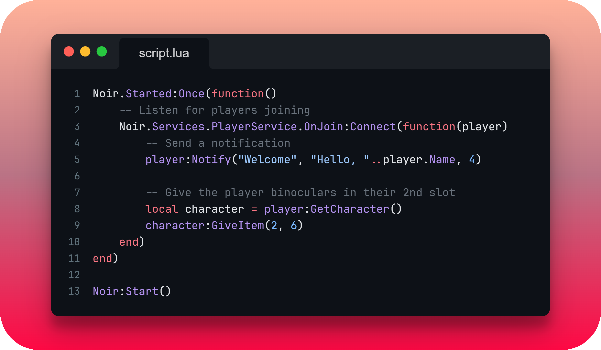

    
    
    

## 📚 Overview
Noir is a framework for Stormworks: Build and Rescue designed to (metaphorically!) hold your hand in some areas with addon development, while also giving you a neat way of organizing your addon.

Helpful examples can be found in [`/examples`](/examples).

## 🍗 Code Snippet
The below snippet showcases Noir's events system as well as the OOP nature of the framework. The code below simply sends a notification to any player who joins and gives them an item.

    

## 📜 Documentation
Documentation can be found [here](https://cuhhub.gitbook.io/noir/).

## 🔨 Installation
For learning how to install and use Noir in your addon, please check out the [documentation.](https://cuhhub.gitbook.io/noir/)

## ⚙️ Building Noir
To build Noir (tool executables and bundled Noir `.lua` file), see below.

### Prerequisites
- Ensure Python 3.13+ is installed (may work on earlier 3.x versions, only tested with 3.13).

### Steps
1) Create a virtual environment (venv) by running `py -m venv venv` (you may need to use `pip install venv` if the command doesn't work).
2) Activate the venv using `venv\scripts\activate.bat` (Linux/MacOS: `source venv/bin/activate`). Use `deactivate` instead of `activate` to exit the venv at any time.
3) Run `pip install -r requirements.txt` to install necessary Python packages.
4) With the venv activated and necessary packages installed, simply run `py build.py`. This will bundle Noir into one `.lua` file as well as build all tools in `/tools` into executables. All of the files are then placed into `_build`.

⚠️ | If `py` in the commands above doesn't work, try `python` or `python3` instead.

## ✨ Credit
- [Cuh4](https://github.com/Cuh4)
- [Avril112113](https://github.com/Avril112113)