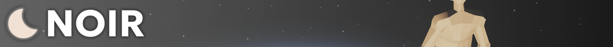
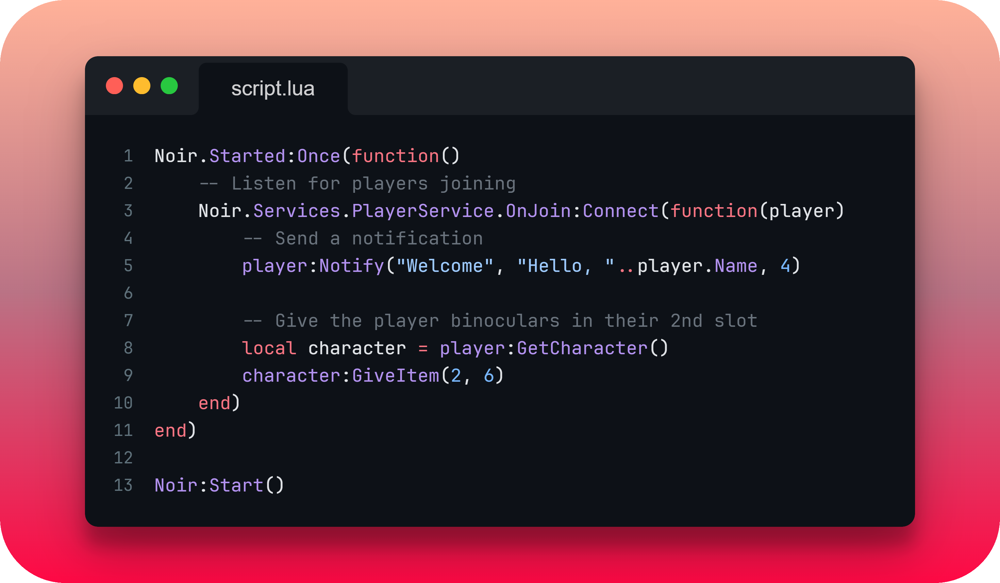
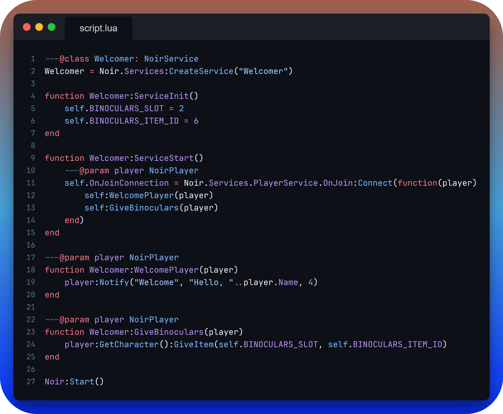

    
    
    

## 📚 Overview
Noir is a framework for Stormworks: Build and Rescue designed to hold your hand in some areas with addon development. Noir also introduces structured development through a clean architecture based on services, libraries and classes (Noir adds class support!). It also reduces boilerplate as Noir comes with built-in services (eg: `PlayerService`), libraries and classes out of the box.

In Noir, your addon is divided into "services" - self-contained logic units that can interact with libraries, classes and other services alike. Libraries are purely for reusable logic that do not interact with the game but provide utilities instead (like math utilities, etc). Classes, on the other hand, purely define structured data and behaviour and is a big portion of the OOP nature of Noir.

Noir is complicated to understand at first, so consider looking at the examples which can be found in [`/examples`](/examples). Looking at the [source code for built-in services, libraries, etc](/src/Noir/Built-Ins), may also help you.

## 🍗 Code Snippet
The below snippet showcases Noir's events system as well as the OOP nature of the framework. The code below simply sends a notification to any player who joins and gives them an item.

    

However, if you want to stay true to Noir's design philosophy by using services, it'd look like:

    

## 📜 Documentation
Documentation can be found [here](https://cuhhub.gitbook.io/noir/).

## 🔨 Installation
For learning how to install and use Noir in your addon, please check out the [documentation.](https://cuhhub.gitbook.io/noir/)

## 🤝 Contributing
If you would like to contribute to Noir, whether that is by creating an issue or by creating a PR, please review [this page in the Noir documentation](https://cuhhub.gitbook.io/noir/contributing) first.

## ⚙️ Building Noir
To build Noir (tool executables and the bundled Noir `.lua` file), see below.

### Prerequisites
- Ensure Python 3.13+ is installed (may work on earlier 3.x versions, only tested with 3.13).
- Ensure your working directory is the folder containing this README (root).

### Steps
1) Create a virtual environment (venv) by running `py -m venv venv` (you may need to use `pip install venv` if the command doesn't work).
2) Activate the venv using `venv\scripts\activate.bat` (Linux/MacOS: `source venv/bin/activate`). Use `deactivate` instead of `activate` to exit the venv at any time.
3) Run `pip install -r requirements.txt` to install necessary Python packages.
4) With the venv activated and necessary packages installed, simply run `build.bat`. This will bundle Noir into one `.lua` file and build all tools in `/tools` into executables by running `py main.py`. The API reference will also get updated (`py build-api-reference.py`). All of the files are then placed into `_build` while the API reference docs will simply be updated in the `docs` folder.

### Warnings
- ⚠️ | If `py` in the commands above doesn't work, try `python` or `python3` instead.
- ⚠️ | `build.bat` is Windows only. You may need to create your own file that does the same and is compatible with your OS if you're not on Windows.

## ✨ Credit
- [Cuh4](https://github.com/Cuh4)
- [Avril112113](https://github.com/Avril112113)