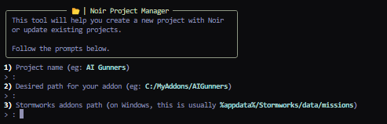
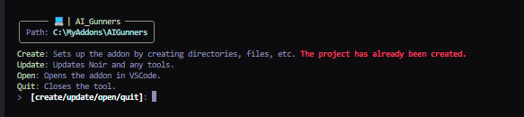

# 🚶‍♂️ Intro

## Links

[Noir GitHub Repo](https://github.com/cuhHub/Noir)

[Discord Community](https://dsc.gg/cuhhubsw)

## What Is Noir?

Noir is a framework that helps Stormworks addon developers create addons with a neat, modular structure.

Noir also comes with built-in [services](tutorials/services.md) and [libraries](tutorials/libraries.md) to reduce the amount of code you have to write.

## Setting Up a Project With Noir

Noir comes with a tool to help you set up a project with Noir in just a minute. This section will show you how to install and use it.

Note that this tool has only been tested on Windows. MacOS and Linux are untested but should work.

1.  Head over to [here](https://github.com/cuhHub/Noir/releases/latest/download/project_manager.exe) to download the compiled Project Manager tool.

    ⚠️ | If you don't trust the `.exe` and have Python installed, head to `/tools/project_manager` in the [Noir repo](https://github.com/cuhHub/Noir) to run from source instead.
2. Run the downloaded `.exe` in a terminal. You'll see the tool description along with prompts below it. Simply follow what the prompts ask to set up your project.
3. The first prompt asks for the project name. This is the name of your addon essentially. For example, you could put `AI Gunners` if your desired addon is based around AI gunners.
4. The second prompt asks for the desired path to your addon. This path can be anywhere. I recommend somewhere in your `Documents` folder (if on Windows). For example: `C:/Users/JohnDoe/Documents/Addons/AIGunners`.
5. The third prompt asks for the path to your Stormworks addons. On Windows, this is 1000% `%appdata%/Stormworks/data/missions`.

Good job! After all of that, you'll enter a new area of the tool that allows you to create the addon (create all necessary files), update the addon (update Noir and tools), open the addon in VSCode (or if not possible, file explorer), and exit the tool.

Simply type `create` to create the addon. This will automatically open the addon after creation is complete.

If Noir receives an update, simply repeat the previous steps and type `update` instead of `create`.

## Using the Stormworks Lua VSCode Extension Instead

This assumes you have the [Stormworks Lua VSCode Extension.](https://marketplace.visualstudio.com/items?itemName=NameousChangey.lifeboatapi)

1. Download [Noir.lua](https://github.com/cuhHub/Noir/releases/latest/download/Noir.lua).
2. Move the downloaded file into your addon directory.
3. Add `require("Noir")` into your addon's main file.
4. Build your addon via the extension's build keybind or the build command in the command palette (`CTRL + SHIFT + P`)

## Congratulations!

You've set up your addon with Noir. Head to the Tutorials section to figure out:

* How to start Noir
* Services
* Libraries
* ...etc
